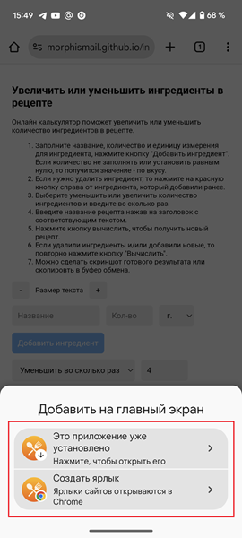

# Увеличить или уменьшить ингредиенты в рецепте

Онлайн калькулятор поможет увеличить или уменьшить количество ингредиентов в рецепте.

## Как работает приложение?

1. Добавляем все ингредиенты рецепта. Заполняем название, количество и единицу измерения, нажимаем на кнопку "Добавить ингредиент". 

2. Выбираем уменьшить или увеличить и во сколько раз, нажимаем "Вычислить".

3. Делаем скриншот нового рецепта и сохраняем у себя в галерее или нажимаем на кнопку ниже и копируем в буфер обмена. Далее можно вставить текст рецепта в любом месте.

4. Инструкция доступна в приложении и находится в самом верху.

## Как установить приложение на смартфон?

1. Откройте ссылку в браузере [https://morphismail.github.io/ingredients_in_recipe/](https://morphismail.github.io/ingredients_in_recipe/)

2. Нажмите на кнопку открыть меню (слева вверху, часто значок три точки или линии). И выберите пункт "Добавить на главный экран".

3. Нажмите на кнопку установить или создать ярлык, на ваш выбор. Ярлык будет открывать ссылку в браузере, если установить приложение, то оно будет открываться без адресной строки как отдельное от браузера приложение.

4. После этого у вас появится значок данного приложения на рабочем столе. Его можно переместить куда вам удобно и пользоваться в любое время.

## Что нового?

28 января 2025

- Добавлена возможность изменять размер текста.
- Добавлена возможность копировать рецепт в буфер обмена.
- Добавлена ссылка для связи с автором.
- Инструкция теперь скрыта, чтобы увидеть ее нужно кликнуть по раскрывающемуся меню с текстом "Инструкция".

## Связь с автором

Если нашли ошибку в тексте или работе программы, а также с вопросами и пожеланиями о данном инструменте, пожалуйста напишите автору на почту ismail_2016@mail.ru